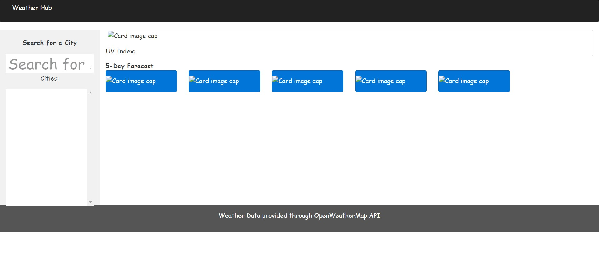

# Weather Hub

# Built With
### Languages
* HTML
* CSS
* Javascript

### Libraries/Frameworks
* JQuery
* Moment.js
* [Foundation](https://get.foundation/)
* Google Fonts

## Preview of Project

## Functionality
* A user may input a city they'd like to view the weather for and current as well as future weather will be displayed to them.
* A user's prior searches are stored in a left-hand column. They are able to click on a city name and the weather data for that city will be displayed.
* Past searches are also saved to local storage and will be accessible on a page refresh.
* A user may also clear all prior searches should they so choose.
* A city's UV Index is color-coded to match UV index risk ranges [Green => Low, Yellow => Moderate, Orange => High, Red => Very High].

## Access the Project
* Github repository available [here](https://github.com/ktodoran/weather-hub)
* Live web page available at [https://ktodoran.github.io/weather-hub/](https://ktodoran.github.io/weather-hub/)